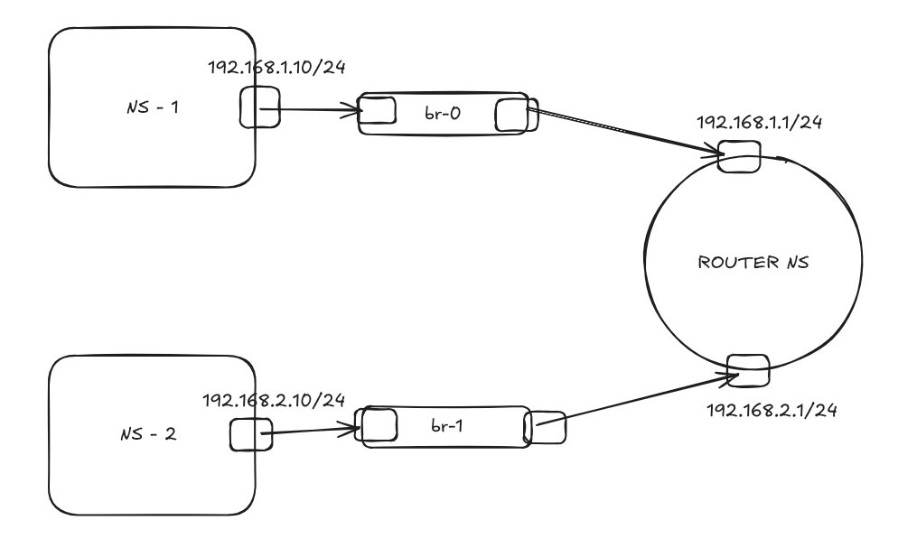

## The Network Layout

* **Namespace 1 (ns1):** A virtual PC in Subnet A (192.168.1.10).
* **Namespace 2 (ns2):** A virtual PC in Subnet B (192.168.2.10).
* **Router (router-ns):** Connects Subnet A and Subnet B so they can talk to each other.
* **Bridges (br0, br1):** Act as virtual switches for each subnet.


## Testing Procedures and Results.
* **Pinging from ns1:**
  .
* **Pinging from ns2:**
  


## Prerequisites

You need a Linux system (like Ubuntu). You must have `sudo` privileges.

## How to Use

1.  **Download the script:** Save your script as `setup_network.sh`.
2.  **Make it executable:**
    ```bash
    chmod +x router.sh
    ```
3.  **Run the script:**
    ```bash
    sudo ./router.sh
    ```
